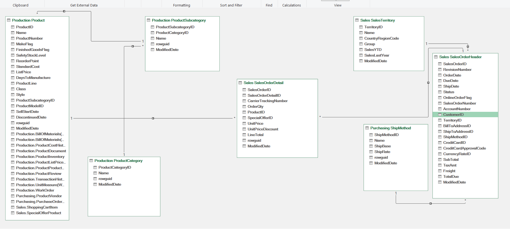

# AdventureWorks Sales Performance Dashboard

An interactive sales dashboard built in Microsoft Excel using data from the AdventureWorks database.

## Dashboard Preview

## Project Overview

This project covers the process of connecting Excel to the AdventureWorks database, preparing data for analysis, building a data model, and presenting sales insights in an interactive dashboard.

## Data Sources

The project uses these tables:

- Product
- ProductSubcategory
- ProductCategory
- SalesOrderDetail
- SalesOrderHeader
- SalesTerritory
- ShipMethod

## Data Model

The data model connects product and category information to sales order details, and links order headers to territory and shipping method information.

## Dashboard Contents

### KPI Cards

- Total Sales
- Total Units Sold
- Number of Orders
- Average Unit Price

### Charts

- Total Sales by Ship Method
- Total Sales by Territory Group
- Total Sales by Product Category
- Total Sales by Year

### Slicers

- Ship Method
- Territory Group
- Product Category

## Tools

- Microsoft Excel
- Power Query
- Power Pivot / Excel Data Model
- AdventureWorks database
